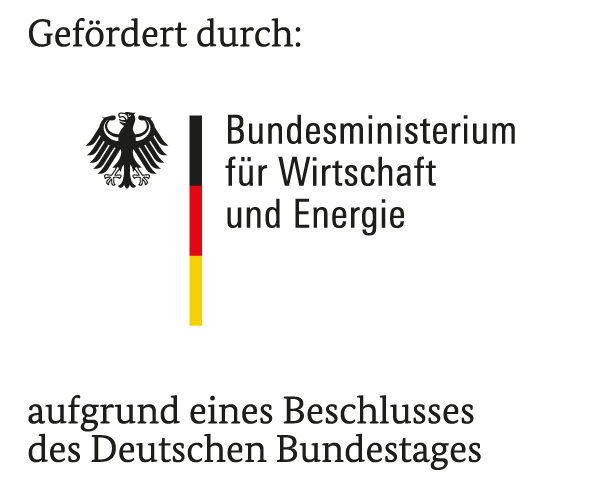

# ICEY 

ICEY is a new API for the Robot Operating System (ROS) 2 that allows for modern asynchronous programming. It offers Streams, Promises and C++20 coroutines with async/await syntax. This simplifies application code and makes the asynchronous data-flow clearly visible. 
This enables fast prototyping with less boilerplate code.

Problems ICEY solves: 
  - No danger of deadlocks since there is no need to manually spin the ROS executor (event loop)
  - No possibility possibility of memory leaks when services do not respond -- every service call has a timeout
  - Modern async/await syntax: All callbacks can be asynchronous (i.e. coroutines), you can `co_await` other asynchronous operations like service calls inside 
  - Consistent awaiting of asynchronous operations: service call, TF lookup
  - Easily accessible synchronization of topics

It is fully compatible to the ROS 2 API and allows for gradual adoption. It supports all major features of ROS: parameters, subscriptions, publishers, timers, services, clients, TF. It supports not only regular nodes but also lifecycle nodes with a single API. 

ICEY operates smoothly together with the  `message_filters` package, and it uses it for synchronization. ICEY also allows for extension, demonstrated by the the support for `image_transport` camera subscription/publishers that is already implemented.

It offers additional goodies such as:
- Automatic bookkeeping of publishers/subscriptions/timers so that you do not have to do it 
- No callback groups needed for preventing deadlocks -- async/await allows for synchronously looking code while the service calls remain asynchronous

ICEY supports ROS 2 Humble and ROS 2 Jazzy.

The [icey_examples](icey_examples) package contains many different example nodes, demonstrating the capabilities of ICEY.


## Features

### Service calls using async/await

Service calls can be awaited, a timeout has to be specified (no manual cleanup of pending requests required!): 

```cpp
auto service = node->icey().create_client<ExampleService>("set_bool_service");

icey().create_timer(1s)
    .then([this](size_t) -> icey::Promise<void> {
        /// Build a request each time the timer ticks
        auto request = std::make_shared<ExampleService::Request>();
        request->data = true;

        /// Call the service (asynchronously) and await the response with 1 second timeout:
        auto result = co_await service.call(request, 1s);
        
        if (result.has_error()) {
            /// Handle errors: (possibly "TIMEOUT" or "INTERRUPTED")
            RCLCPP_INFO_STREAM(node->get_logger(), "Got error: " << result.error());
        } else {
            RCLCPP_INFO_STREAM(node->get_logger(), "Got response: " << result.value()->success);
        }
        co_return;
    })
```
See also the [Service client](../../../icey_examples/src/service_client_async_await.cpp) example.

### Asynchronous service server callbacks: 

With ICEY you can use *asynchronous* functions (i.e. coroutines) as service callbacks, for example to call another upstream service:

```cpp
/// Create a service client for an upstream service that is actually capable of answering the
/// request.
auto upstream_service_client =
      node->icey().create_client<ExampleService>("set_bool_service_upstream");

node->icey().create_service<ExampleService>(
      "set_bool_service", 
        /// An asynchronous callback (coroutine) returns a Promise<Response>:
        [&](auto request) -> icey::Promise<Response> {

        /// Call the upstream service with 1s timeout asynchronously:
        auto upstream_result = co_await upstream_service_client.call(request, 1s);

        if (upstream_result.has_error()) {
          RCLCPP_INFO_STREAM(node->get_logger(),
                             "Upstream service returned error: " << upstream_result.error());
          /// Return nothing: This will simply not respond to the client, leading to a timeout
          co_return nullptr;
        } else {
          Response upstream_response = upstream_result.value();
          /// Respond to the client with the upstream server's response:
          co_return upstream_response;
        }
        
      });
```
See also the [Service server](../../../icey_examples/src/service_server_async_await.cpp) example.


## Async Flow:

Easy synchronization of an arbitrary amount of topics (using approximate time policy): 

```cpp
auto camera_image = node->icey().create_subscription<sensor_msgs::msg::Image>("camera");
auto point_cloud = node->icey().create_subscription<sensor_msgs::msg::PointCloud2>("point_cloud");

  /// Synchronize by approximately matching the header time stamps (queue_size=100):
  icey::synchronize_approx_time(100, camera_image, point_cloud)
      .then([](sensor_msgs::msg::Image::SharedPtr,
               sensor_msgs::msg::PointCloud2::SharedPtr) {
      });
```

Detecting timeouts on topics: 
```cpp
  node->icey().create_subscription<geometry_msgs::PoseStamped>("ego_pose")
    /// Expect that every pose message is at most 200ms old
    .timeout(200ms)
    /// "unwrap_or" handles calls the provided callback in case of error
    .unwrap_or([&](auto current_time, auto msg_time, auto max_age) {
        auto msg_dt = (current_time - message_timestamp).seconds();
        RCLCPP_ERROR_STREAM_THROTTLE(this->get_logger(), *this->get_clock(), 1000, fmt::format(
            "Timeout occured, message is old: {} seconds old, maximum allowed is {} seconds",
            msg_dt, max_age));
    }) 
    .then([](geometry_msgs::PoseStamped::SharedPtr pose_msg) {
      /// All message received here are at most 200ms old
    });
```

Filtering messages that contain NaNs: 

```cpp
node->icey().create_subscription<geometry_msgs::PoseStamped>("ego_pose")
    /// Filter (i.e. remove) messages that contain NaNs:
    .filter([](geometry_msgs::PoseStamped::SharedPtr pose_msg) -> bool {
        return !(std::isnan(pose_msg->pose.x) 
                  ||std::isnan(pose_msg->pose.y) 
                  || std::isnan(pose_msg->pose.z));
    })
    .then([](geometry_msgs::PoseStamped::SharedPtr pose_msg) {
      /// Here we receive only NaN-free messages for further processing
    });
```

# Dependencies: 

- C++20 
- ROS 2 Humble or Jazzy
- Boost (Hana, typeinfo)
- FMT

Note that ROS 2 Humble is as of now (April 2025) already forward compatible with C++20 (compiling ROS-headers with `-std=c++20`): Information you will find online stating the contrary is simply outdated.

# Install 

Just clone this repository to your workspace, install dependencies and compile: 

```sh
git clone https://github.com/DriverlessMobility/icey.git
sudo apt install libboost-dev libfmt-dev
MAKEFLAGS="-j4" colcon build --packages-select icey icey_examples --cmake-args -DCMAKE_BUILD_TYPE=Release
```

Note: Use `MAKEFLAGS="-j4"` to prevent you system from freezing. 

<details>

<summary>Explaination</summary>

By default, `colcon` will start as many compiler processes as there are CPU cores, if there are enough translation units (TU) to compile in parallel. The `icey_example` package contains ~20 examples and therefore TUs. Since GCC requires 1-3 GiB of RAM to compile a single TU using icey, on a machine with 20 CPU cores (such as a 12th generation Intel i7) and only 32 GiB of RAM, this will require more RAM than is available. So Linux starts swapping, which takes a very long time because at the same time the CPU load is also high. The result is an effectively unresponsive system.
Linux has an out-of-memory killer (OOM killer), but by default it is configured to be effectively useless, it won't kill the GCC processes.
By passing the option `MAKEFLAGS="-j4"`, only four jobs will be used, i.e. only 4 TUs will be compiled in parallel. This will prevent your system from freezing assuming you have at least 12 GiB of RAM.
Of course (and after you read this far) you can set it to whatever value you like.
We just want to prevent your first experience with ICEY from being "it freezes your system and you have to reboot", which would be very unpleasant.
</details>

# Documentation 

The documentation can be found here:

# Limitations

Our goal with ICEY is to support everything that ROS supports.
However, there are a few minor limitations:

- Not thread-safe: only the `SingleThreadedExecutor` is supported currently
- Memory strategy is not implemented
- Sub-nodes are not supported

# License 
 This software is licensed under the Apache License, Version 2.0.

# Acknowledgements




This project has received funding from  the german Bundesministerium für Wirtschaft und Energie, during the project *RDV - Real Drive Validation - Erweiterung der Überprüfbarkeit von Continuous Software Integration in Kommunikation mit Fahrzeugen im Feld, Teilvorhaben Sicherheitsnachweis im Entwicklungszyklus für hochautomatisierte Fahrzeuge*, 
grant number 19A21051K.